# Human-AI Data Flow

- Source: https://chatgpt.com/share/6a15c671-1c8c-8333-8c11-5f7c9be844b3
- Conversation id: `6a15c671-1c8c-8333-8c11-5f7c9be844b3`
- Model: GPT-5.5 (`gpt-5-5`)
- Conversation created: 2026-05-26T18:12:33+02:00
- Message span: 2026-05-20T05:18:27+02:00 to 2026-05-20T06:29:23+02:00
- Local timezone: Europe/Zurich
- Message count: 130 (19 system, 32 user, 56 assistant, 23 tool)
- Assets: 24 unique images (22 downloaded into assets/, 2 unavailable)
- Schema note: Active branch only. Images stored in assets/ are the actual binaries fetched from the share page CDN.

---

## System — (no timestamp)

- message_id: `16c5571c-d0d9-4c9b-8325-a353db5ae34c`
- index: 1
- role: system
- recipient: all
- status: finished_successfully
- end_turn: true
- is_visually_hidden_from_conversation: true

### Content

- content_type: text


---

## System — (no timestamp)

- message_id: `bdc616aa-4156-4409-946d-9477eaa40810`
- index: 2
- role: system
- recipient: all
- status: finished_successfully
- end_turn: true
- is_visually_hidden_from_conversation: true

### Content

- content_type: text


---

## System — (no timestamp)

- message_id: `763f8d8c-d35d-4dea-acbc-911c7a3a05d2`
- index: 3
- role: system
- recipient: all
- status: finished_successfully
- end_turn: false
- is_visually_hidden_from_conversation: true

### Content

- content_type: text


---

## User — (no timestamp)

- message_id: `7086d7aa-5227-4c4b-8812-7c0a7b5416e2`
- index: 4
- role: user
- recipient: all
- status: finished_successfully
- is_visually_hidden_from_conversation: true

### Content

- content_type: text

Original custom instructions no longer available

---

## System — (no timestamp)

- message_id: `66f83ac6-ae10-4c9d-ad33-1a8348651394`
- index: 5
- role: system
- recipient: all
- status: finished_successfully
- is_visually_hidden_from_conversation: true

### Content

- content_type: text


---

--- 2026-05-20 ---

## System — 2026-05-20T05:18:27+02:00

- message_id: `84998382-ede0-4781-a765-4f98778c3961`
- index: 6
- role: system
- recipient: all
- create_time_utc: `2026-05-20T03:18:27.862Z`
- status: finished_successfully
- is_visually_hidden_from_conversation: true

### Content

- content_type: text


---

## User — 2026-05-20T05:18:27+02:00

- message_id: `7899b28f-a31b-4966-9823-ade643b8d6bf`
- index: 7
- role: user
- recipient: all
- create_time_utc: `2026-05-20T03:18:27.581Z`
- status: finished_successfully

### Content

- content_type: text

Make a drawing illustration simple

On one side you see a person then the person has a data layer than there is a neural computer than there is a data layer than there is a person

The neural computer is the interface to translate data paired with an intent from the human one one side and the other side then can fulfill that task 


---

## Assistant — 2026-05-20T05:18:28+02:00

- message_id: `bddde32f-32ee-4672-8f71-8b6b3a7c8760`
- index: 8
- role: assistant
- recipient: all
- create_time_utc: `2026-05-20T03:18:28.035Z`
- status: finished_successfully

### Content

- content_type: model_editable_context

```

```

---

## Assistant — 2026-05-20T05:18:28+02:00

- message_id: `a00af364-9d2b-4f25-ab63-68fef23bff0f`
- index: 9
- role: assistant
- recipient: t2uay3k.sj1i4kz
- create_time_utc: `2026-05-20T03:18:28.111Z`
- status: finished_successfully
- end_turn: false

### Content

- content_type: code

```python3
{"skipped_mainline":true}
```

---

## Tool — 2026-05-20T05:18:54+02:00

- message_id: `0fc38029-14c3-446c-8969-5bf788f314f6`
- index: 10
- role: tool
- author_name: `t2uay3k.sj1i4kz`
- recipient: all
- create_time_utc: `2026-05-20T03:18:54.166Z`
- status: finished_successfully

### Content

- content_type: multimodal_text

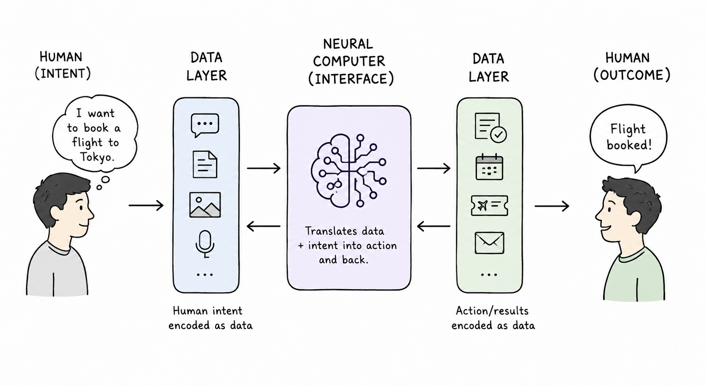

- asset_pointer: `sediment://file_000000004958720aaea0aecf1d06215c?shared_conversation_id=6a15c671-1c8c-8333-8c11-5f7c9be844b3`
- dimensions: 1693x929
- size_bytes: 1122566
- local_file: `assets/01__ai-communication-pipeline-diagram.png`
- download_status: downloaded

---

## User — 2026-05-20T05:20:34+02:00

- message_id: `3d611bdf-7b2c-423c-8ffb-4085d434c46c`
- index: 11
- role: user
- recipient: all
- create_time_utc: `2026-05-20T03:20:34.639Z`
- update_time_utc: `2026-05-20T03:21:18.919Z` (edited)
- status: finished_successfully

### Content

- content_type: text

Ok the other human who fulfills the task is a company that serves the intent


---

## System — 2026-05-20T05:20:35+02:00

- message_id: `4c633cbc-cad8-44ee-a8ef-39f1d4290692`
- index: 12
- role: system
- recipient: all
- create_time_utc: `2026-05-20T03:20:35.245Z`
- status: finished_successfully
- is_visually_hidden_from_conversation: true

### Content

- content_type: text


---

## Assistant — 2026-05-20T05:20:35+02:00

- message_id: `0c1e8f86-8fe3-43ee-ac75-7d0638030a65`
- index: 13
- role: assistant
- recipient: all
- create_time_utc: `2026-05-20T03:20:35.318Z`
- status: finished_successfully

### Content

- content_type: model_editable_context

```

```

---

## Assistant — 2026-05-20T05:20:35+02:00

- message_id: `6bc39aa4-ac6b-4b5e-a7fe-85a3b71bacc2`
- index: 14
- role: assistant
- recipient: t2uay3k.sj1i4kz
- create_time_utc: `2026-05-20T03:20:35.300Z`
- status: finished_successfully
- end_turn: false
- model_slug: gpt-5-5
- message_type: next

### Content

- content_type: code

```unknown
{"size":"1792x1024","n":1}
```

---

## Tool — 2026-05-20T05:21:17+02:00

- message_id: `69fe28bf-2918-4be9-bf5f-37bb40cb9b6c`
- index: 15
- role: tool
- author_name: `t2uay3k.sj1i4kz`
- recipient: all
- create_time_utc: `2026-05-20T03:21:17.172Z`
- status: finished_successfully
- model_slug: gpt-5-5
- message_type: next

### Content

- content_type: multimodal_text

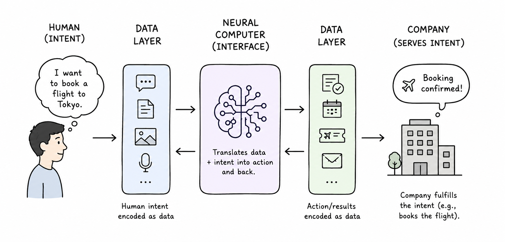

- asset_pointer: `sediment://file_00000000e128720aaccd649d14d13b1c?shared_conversation_id=6a15c671-1c8c-8333-8c11-5f7c9be844b3`
- dimensions: 1810x869
- size_bytes: 1129692
- local_file: `assets/02__human-intent-to-company-fulfillment-flowchart.png`
- download_status: downloaded

---

## Assistant — 2026-05-20T05:21:17+02:00

- message_id: `c260d0bb-c1fa-4b80-a079-afc15fae3c55`
- index: 16
- role: assistant
- recipient: all
- create_time_utc: `2026-05-20T03:21:17.166Z`
- status: finished_successfully
- end_turn: true
- model_slug: gpt-5-5
- message_type: next

### Content

- content_type: text


---

## User — 2026-05-20T05:22:47+02:00

- message_id: `1a33f6eb-aea8-4a79-83a5-7f5e82f6d24c`
- index: 17
- role: user
- recipient: all
- create_time_utc: `2026-05-20T03:22:47.206Z`
- update_time_utc: `2026-05-20T03:23:42.726Z` (edited)
- status: finished_successfully

### Content

- content_type: text

Data layer on human side is the personal one where you have history pictures emails etc that for a specific and unique data layer not go nd ever again or duplicate 

The challenge here is that we need to ensure no one can copy the human and act as fraud

---

## System — 2026-05-20T05:22:49+02:00

- message_id: `8c4360c5-0872-4846-bac7-60df209e0511`
- index: 18
- role: system
- recipient: all
- create_time_utc: `2026-05-20T03:22:49.024Z`
- status: finished_successfully
- end_turn: true
- model_slug: gpt-5-5
- message_type: next
- is_visually_hidden_from_conversation: true

### Content

- content_type: text


---

## Assistant — 2026-05-20T05:22:49+02:00

- message_id: `3601951e-7484-4c84-b26a-31cccbda9755`
- index: 19
- role: assistant
- recipient: all
- create_time_utc: `2026-05-20T03:22:49.024Z`
- status: finished_successfully

### Content

- content_type: model_editable_context

```

```

---

## System — 2026-05-20T05:22:49+02:00

- message_id: `4547be18-8928-4827-89cc-f7ead783ebd1`
- index: 20
- role: system
- recipient: all
- create_time_utc: `2026-05-20T03:22:49.025Z`
- status: finished_successfully
- model_slug: gpt-5-5
- message_type: next
- is_visually_hidden_from_conversation: true

### Content

- content_type: text


---

## Assistant — 2026-05-20T05:22:51+02:00

- message_id: `940234f5-bea7-4f18-bdb2-07cb4e299814`
- index: 21
- role: assistant
- recipient: all
- create_time_utc: `2026-05-20T03:22:51.662Z`
- status: finished_successfully
- end_turn: false
- model_slug: gpt-5-5-thinking
- message_type: next

### Content

- content_type: thoughts

---

## Assistant — 2026-05-20T05:22:48+02:00

- message_id: `5d01c0ee-20b9-48b4-9b68-bd91c6acf4a3`
- index: 22
- role: assistant
- recipient: t2uay3k.sj1i4kz
- create_time_utc: `2026-05-20T03:22:48.070Z`
- status: finished_successfully
- end_turn: false
- model_slug: gpt-5-5-thinking
- message_type: next

### Content

- content_type: code

```json
{"prompt":null,"size":"1792x1024","n":1,"transparent_background":false,"is_style_transfer":false,"referenced_image_ids":null}
```

---

## Tool — 2026-05-20T05:23:38+02:00

- message_id: `22b2519f-4898-498a-96b8-c9ebe4a14df7`
- index: 23
- role: tool
- author_name: `t2uay3k.sj1i4kz`
- recipient: all
- create_time_utc: `2026-05-20T03:23:38.448Z`
- status: finished_successfully
- model_slug: gpt-5-5-thinking
- message_type: next

### Content

- content_type: multimodal_text

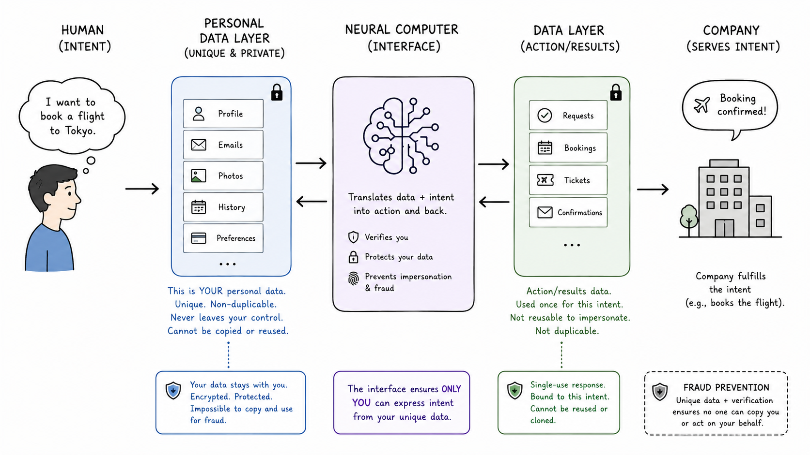

- asset_pointer: `sediment://file_000000001174720ab940ea74ac362de9?shared_conversation_id=6a15c671-1c8c-8333-8c11-5f7c9be844b3`
- dimensions: 1672x941
- size_bytes: 1240138
- local_file: `assets/03__secure-ai-data-flow-infographic.png`
- download_status: downloaded

---

## Assistant — 2026-05-20T05:23:41+02:00

- message_id: `51a35786-18e5-4437-9b87-1671799ddcbc`
- index: 24
- role: assistant
- recipient: all
- create_time_utc: `2026-05-20T03:23:41.725Z`
- status: finished_successfully
- end_turn: false
- model_slug: gpt-5-5
- message_type: next

### Content

- content_type: reasoning_recap

---

## Assistant — 2026-05-20T05:23:38+02:00

- message_id: `48be3a62-69e7-43b8-bc68-f61b2ddf1790`
- index: 25
- role: assistant
- recipient: all
- create_time_utc: `2026-05-20T03:23:38.432Z`
- status: finished_successfully
- end_turn: true
- model_slug: gpt-5-5-thinking
- message_type: next

### Content

- content_type: text


---

## User — 2026-05-20T05:24:24+02:00

- message_id: `72b07d9b-4596-4b3f-8e6e-0592df5d5b37`
- index: 26
- role: user
- recipient: all
- create_time_utc: `2026-05-20T03:24:24.957Z`
- update_time_utc: `2026-05-20T03:25:41.786Z` (edited)
- status: finished_successfully

### Content

- content_type: text

No it’s not human inten encoded as data but the data layer is practically a representation of that human maybe we make the data layer a a ghost image of the to visualize the uniqueness of the human

---

## System — 2026-05-20T05:24:26+02:00

- message_id: `c3fa9c1a-2546-4aa8-a8e2-bfef9b846da6`
- index: 27
- role: system
- recipient: all
- create_time_utc: `2026-05-20T03:24:26.493Z`
- status: finished_successfully
- end_turn: true
- model_slug: gpt-5-5
- message_type: next
- is_visually_hidden_from_conversation: true

### Content

- content_type: text


---

## Assistant — 2026-05-20T05:24:26+02:00

- message_id: `8f9df2ab-6a9f-4096-b07f-ad5bf39113e7`
- index: 28
- role: assistant
- recipient: all
- create_time_utc: `2026-05-20T03:24:26.493Z`
- status: finished_successfully

### Content

- content_type: model_editable_context

```

```

---

## System — 2026-05-20T05:24:26+02:00

- message_id: `7a7ef8cc-15a9-458b-80ee-84bdef10e689`
- index: 29
- role: system
- recipient: all
- create_time_utc: `2026-05-20T03:24:26.494Z`
- status: finished_successfully
- model_slug: gpt-5-5
- message_type: next
- is_visually_hidden_from_conversation: true

### Content

- content_type: text


---

## Assistant — 2026-05-20T05:24:25+02:00

- message_id: `d7fc6d87-6789-4e13-a0a1-9b51f7b56e75`
- index: 30
- role: assistant
- recipient: t2uay3k.sj1i4kz
- create_time_utc: `2026-05-20T03:24:25.809Z`
- status: finished_successfully
- end_turn: false
- model_slug: gpt-5-5-thinking
- message_type: next

### Content

- content_type: code

```json
{"prompt":null,"size":"1792x1024","n":1,"transparent_background":false,"is_style_transfer":false,"referenced_image_ids":null}
```

---

## Tool — 2026-05-20T05:25:36+02:00

- message_id: `0252bc80-9bd3-4a55-a719-7c2ec5910387`
- index: 31
- role: tool
- author_name: `t2uay3k.sj1i4kz`
- recipient: all
- create_time_utc: `2026-05-20T03:25:36.271Z`
- status: finished_successfully
- model_slug: gpt-5-5-thinking
- message_type: next

### Content

- content_type: multimodal_text

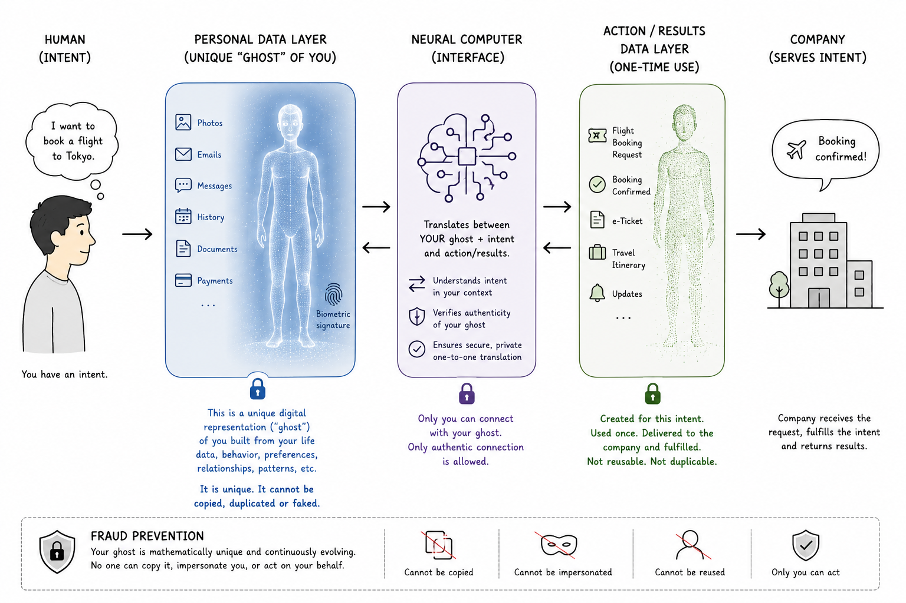

- asset_pointer: `sediment://file_0000000055c07246af4702c80caf15d3?shared_conversation_id=6a15c671-1c8c-8333-8c11-5f7c9be844b3`
- dimensions: 1536x1024
- size_bytes: 1563644
- local_file: `assets/04__personal-data-protection-and-intent-flow.png`
- download_status: downloaded

---

## Tool — 2026-05-20T05:25:36+02:00

- message_id: `0d23a63f-af46-40c8-b5c2-ca35f3d72949`
- index: 32
- role: tool
- author_name: `t2uay3k.sj1i4kz`
- recipient: all
- create_time_utc: `2026-05-20T03:25:36.344Z`
- status: finished_successfully
- model_slug: gpt-5-5-thinking
- message_type: next

### Content

- content_type: multimodal_text

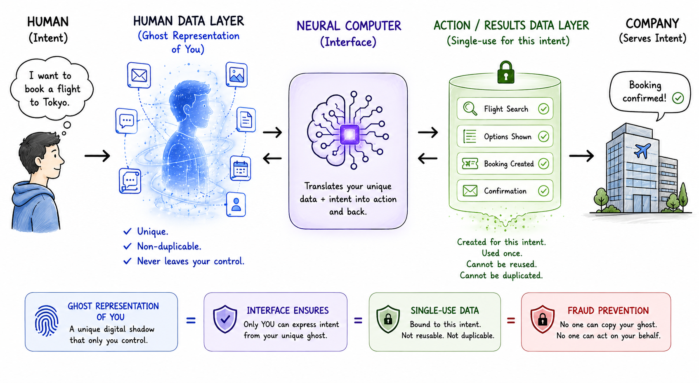

- asset_pointer: `sediment://file_00000000e50472468c25b405c02e9e4d?shared_conversation_id=6a15c671-1c8c-8333-8c11-5f7c9be844b3`
- dimensions: 1694x929
- size_bytes: 1503015
- local_file: `assets/05__secure-identity-and-service-flow.png`
- download_status: downloaded

---

## Assistant — 2026-05-20T05:25:36+02:00

- message_id: `e5f61e40-970a-4da8-b725-bc8c13bdc395`
- index: 33
- role: assistant
- recipient: all
- create_time_utc: `2026-05-20T03:25:36.333Z`
- status: finished_successfully
- end_turn: true
- model_slug: gpt-5-5-thinking
- message_type: next

### Content

- content_type: text


---

## User — 2026-05-20T05:25:45+02:00

- message_id: `e376246e-d5fa-4e4b-bf5a-a627ef71caf6`
- index: 34
- role: user
- recipient: all
- create_time_utc: `2026-05-20T03:25:45.556Z`
- update_time_utc: `2026-05-20T03:27:01.479Z` (edited)
- status: finished_successfully

### Content

- content_type: text

No the interface translates your intent so the other side can understand you better meaning the company
Maybe we can make that company a butler

---

## System — 2026-05-20T05:25:45+02:00

- message_id: `16d38b5c-f4c2-42eb-97cb-446037454d7f`
- index: 35
- role: system
- recipient: all
- create_time_utc: `2026-05-20T03:25:45.887Z`
- status: finished_successfully
- end_turn: true
- model_slug: gpt-5-5
- message_type: next
- is_visually_hidden_from_conversation: true

### Content

- content_type: text


---

## Assistant — 2026-05-20T05:25:45+02:00

- message_id: `75d3da33-5fae-4181-a595-cb6ccee53bdd`
- index: 36
- role: assistant
- recipient: all
- create_time_utc: `2026-05-20T03:25:45.929Z`
- status: finished_successfully

### Content

- content_type: model_editable_context

```

```

---

## Assistant — 2026-05-20T05:25:45+02:00

- message_id: `83d84cfa-feba-4330-b6d0-6afdee3cd101`
- index: 37
- role: assistant
- recipient: t2uay3k.sj1i4kz
- create_time_utc: `2026-05-20T03:25:45.926Z`
- status: finished_successfully
- end_turn: false
- model_slug: gpt-5-5
- message_type: next

### Content

- content_type: code

```unknown
{"size":"1792x1024","n":1,"transparent_background":false,"is_style_transfer":false}
```

---

## Tool — 2026-05-20T05:26:58+02:00

- message_id: `6dbc39e8-3524-425d-b09f-8e88f5ce1807`
- index: 38
- role: tool
- author_name: `t2uay3k.sj1i4kz`
- recipient: all
- create_time_utc: `2026-05-20T03:26:58.977Z`
- status: finished_successfully
- model_slug: gpt-5-5
- message_type: next

### Content

- content_type: multimodal_text

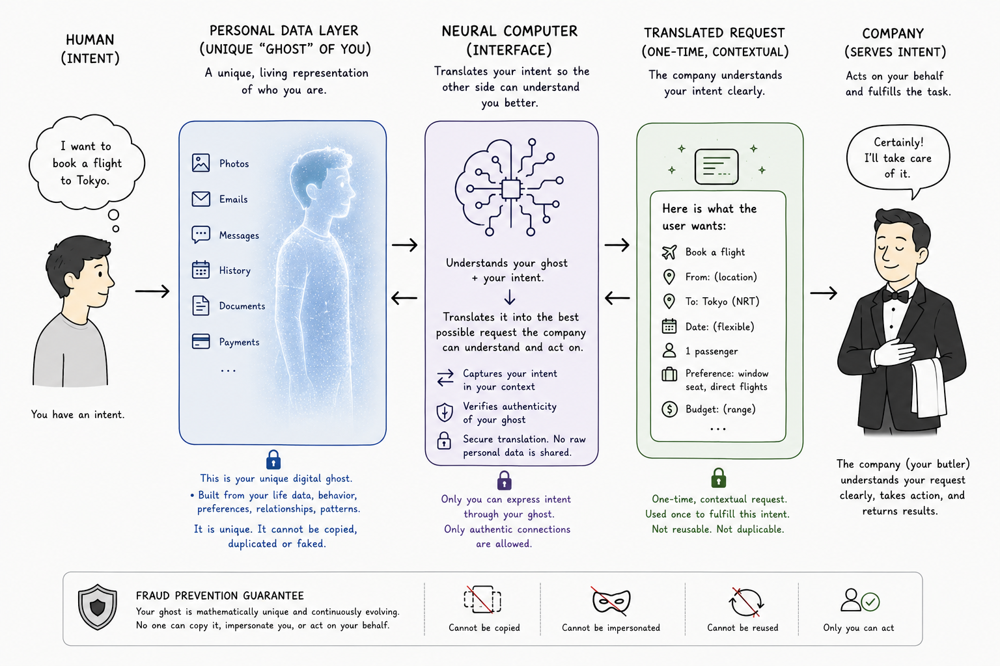

- asset_pointer: `sediment://file_000000004df4720a8542e85f6f6084a0?shared_conversation_id=6a15c671-1c8c-8333-8c11-5f7c9be844b3`
- dimensions: 1536x1024
- size_bytes: 1671950
- local_file: `assets/06__the-journey-of-your-intent.png`
- download_status: downloaded

---

## Assistant — 2026-05-20T05:26:58+02:00

- message_id: `e891749c-5ca3-43a1-b2b1-47e0c97e0081`
- index: 39
- role: assistant
- recipient: all
- create_time_utc: `2026-05-20T03:26:58.971Z`
- status: finished_successfully
- end_turn: true
- model_slug: gpt-5-5
- message_type: next

### Content

- content_type: text


---

## User — 2026-05-20T05:31:31+02:00

- message_id: `c3b0ea44-70e0-4022-ba47-6cac2552ff45`
- index: 40
- role: user
- recipient: all
- create_time_utc: `2026-05-20T03:31:31.920Z`
- update_time_utc: `2026-05-20T03:32:42.119Z` (edited)
- status: finished_successfully

### Content

- content_type: text


Maybe we can actually have another later between ghost and neural interface that is the interface which is picture and sound that helps the human to pick and choose and specify and manipulate the intent or say refine the intent


---

## Assistant — 2026-05-20T05:31:32+02:00

- message_id: `b6e27475-a163-4207-add4-b6c12d247c07`
- index: 41
- role: assistant
- recipient: all
- create_time_utc: `2026-05-20T03:31:32.264Z`
- status: finished_successfully

### Content

- content_type: model_editable_context

```

```

---

## Assistant — 2026-05-20T05:31:32+02:00

- message_id: `2a969262-665e-47ab-8273-3f7148f9c918`
- index: 42
- role: assistant
- recipient: t2uay3k.sj1i4kz
- create_time_utc: `2026-05-20T03:31:32.260Z`
- status: finished_successfully
- end_turn: false
- model_slug: gpt-5-5
- message_type: next

### Content

- content_type: code

```unknown
{"size":"1792x1024","n":1}
```

---

## Tool — 2026-05-20T05:32:38+02:00

- message_id: `14f88b2c-e3d8-4576-baca-0d801e02b771`
- index: 43
- role: tool
- author_name: `t2uay3k.sj1i4kz`
- recipient: all
- create_time_utc: `2026-05-20T03:32:38.604Z`
- status: finished_successfully
- model_slug: gpt-5-5
- message_type: next

### Content

- content_type: multimodal_text

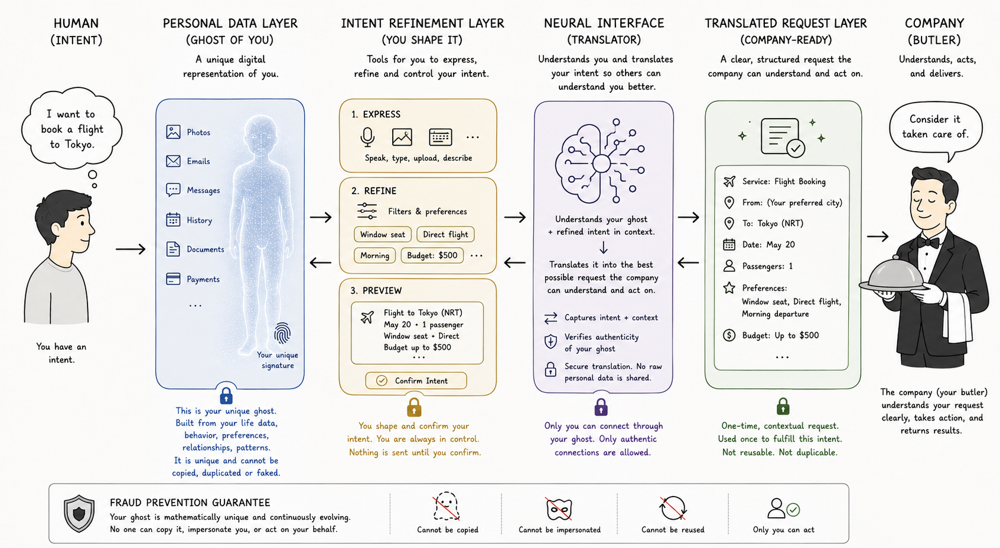

- asset_pointer: `sediment://file_00000000bfd87243868ecd69adaaef69?shared_conversation_id=6a15c671-1c8c-8333-8c11-5f7c9be844b3`
- dimensions: 1693x929
- size_bytes: 1721501
- local_file: `assets/07__human-to-company-flow-diagram.png`
- download_status: downloaded

---

## Assistant — 2026-05-20T05:32:38+02:00

- message_id: `e6a5ea93-4e74-439f-9b51-3298769f7804`
- index: 44
- role: assistant
- recipient: all
- create_time_utc: `2026-05-20T03:32:38.586Z`
- status: finished_successfully
- end_turn: true
- model_slug: gpt-5-5
- message_type: next

### Content

- content_type: text


---

## User — 2026-05-20T05:34:11+02:00

- message_id: `df26150d-f211-49a0-9a2b-26491993d40d`
- index: 45
- role: user
- recipient: all
- create_time_utc: `2026-05-20T03:34:11.639Z`
- update_time_utc: `2026-05-20T03:35:23.680Z` (edited)
- status: finished_successfully

### Content

- content_type: text

Ok make the intent refinement layer a pan of Glas because this is what represents the phone/ TV display interface we use to point and see as we are visual primates primarily 

---

## Assistant — 2026-05-20T05:34:12+02:00

- message_id: `720962fb-e55f-4c5b-ae6c-8f21d5e2efe3`
- index: 46
- role: assistant
- recipient: all
- create_time_utc: `2026-05-20T03:34:12.121Z`
- status: finished_successfully

### Content

- content_type: model_editable_context

```

```

---

## Assistant — 2026-05-20T05:34:12+02:00

- message_id: `cb694a9e-fd16-43d6-ae63-25e51ccee29f`
- index: 47
- role: assistant
- recipient: t2uay3k.sj1i4kz
- create_time_utc: `2026-05-20T03:34:12.118Z`
- status: finished_successfully
- end_turn: false
- model_slug: gpt-5-5
- message_type: next

### Content

- content_type: code

```unknown
{"size":"1792x1024","n":1}
```

---

## Tool — 2026-05-20T05:35:21+02:00

- message_id: `caf1f5e4-c179-4c6b-bb0b-7cbf2dfee5dd`
- index: 48
- role: tool
- author_name: `t2uay3k.sj1i4kz`
- recipient: all
- create_time_utc: `2026-05-20T03:35:21.558Z`
- status: finished_successfully
- model_slug: gpt-5-5
- message_type: next

### Content

- content_type: multimodal_text

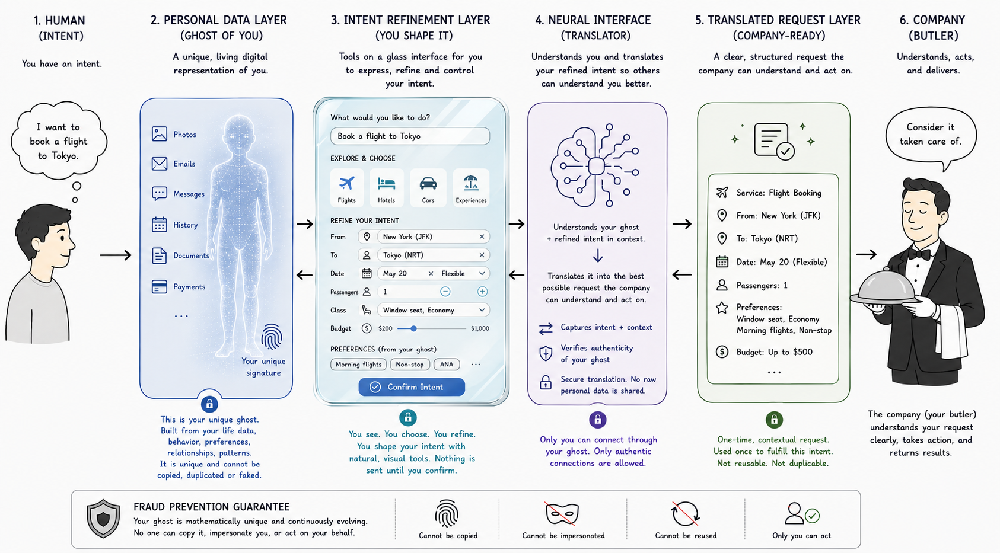

- asset_pointer: `sediment://file_00000000bda071f4af3d3077809d33f0?shared_conversation_id=6a15c671-1c8c-8333-8c11-5f7c9be844b3`
- dimensions: 1686x933
- size_bytes: 1631518
- local_file: `assets/08__privacy-and-intent-ai-pipeline-diagram.png`
- download_status: downloaded

---

## Assistant — 2026-05-20T05:35:21+02:00

- message_id: `30b8b57e-0d95-4fc8-9333-6b2cdd9e22e1`
- index: 49
- role: assistant
- recipient: all
- create_time_utc: `2026-05-20T03:35:21.597Z`
- status: finished_successfully
- end_turn: true
- model_slug: gpt-5-5
- message_type: next

### Content

- content_type: text


---

## User — 2026-05-20T05:35:31+02:00

- message_id: `98ae9635-360c-4a43-b894-254c762a70a8`
- index: 50
- role: user
- recipient: all
- create_time_utc: `2026-05-20T03:35:31.024Z`
- status: finished_successfully

### Content

- content_type: text

Keep the ghost look like the human on the left so it’s visually clearer that it’s an identical copy

---

## Assistant — 2026-05-20T05:35:32+02:00

- message_id: `5554c5f8-6490-4e7a-9c80-48ff9f6241ee`
- index: 51
- role: assistant
- recipient: t2uay3k.sj1i4kz
- create_time_utc: `2026-05-20T03:35:32.286Z`
- status: finished_successfully
- end_turn: false

### Content

- content_type: code

```python3
{"skipped_mainline":true}
```

---

## Tool — 2026-05-20T05:36:27+02:00

- message_id: `60ef09fb-ae6c-49b0-96eb-e7347e494a02`
- index: 52
- role: tool
- author_name: `t2uay3k.sj1i4kz`
- recipient: all
- create_time_utc: `2026-05-20T03:36:27.424Z`
- status: finished_successfully

### Content

- content_type: multimodal_text

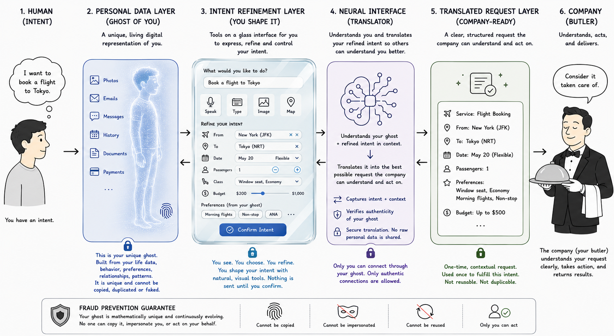

- asset_pointer: `sediment://file_0000000042a0724690430a5dc3964782?shared_conversation_id=6a15c671-1c8c-8333-8c11-5f7c9be844b3`
- dimensions: 1693x929
- size_bytes: 1636576
- local_file: `assets/09__innovative-intent-and-data-flow-diagram.png`
- download_status: downloaded

---

## User — 2026-05-20T05:38:09+02:00

- message_id: `d9a60f11-dbeb-4666-a9c0-0c64daaf389e`
- index: 53
- role: user
- recipient: all
- create_time_utc: `2026-05-20T03:38:09.266Z`
- status: finished_successfully

### Content

- content_type: text

Simplify the glass plane no need for all these filters

One button and one picture  placeholder one icon is enough no drop downs etc

---

## Assistant — 2026-05-20T05:38:09+02:00

- message_id: `258212b1-a5f2-4530-b505-5c58e23d11dc`
- index: 54
- role: assistant
- recipient: t2uay3k.sj1i4kz
- create_time_utc: `2026-05-20T03:38:09.968Z`
- status: finished_successfully
- end_turn: false

### Content

- content_type: code

```python3
{"skipped_mainline":true}
```

---

## Tool — 2026-05-20T05:39:07+02:00

- message_id: `e57e3ae1-db16-41e0-be84-518365ea92dc`
- index: 55
- role: tool
- author_name: `t2uay3k.sj1i4kz`
- recipient: all
- create_time_utc: `2026-05-20T03:39:07.849Z`
- status: finished_successfully

### Content

- content_type: multimodal_text

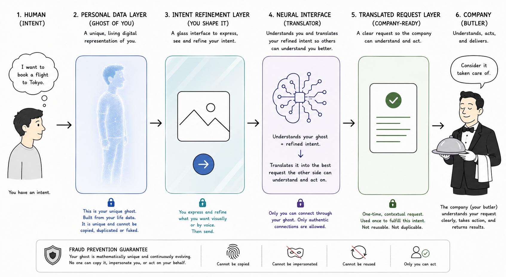

- asset_pointer: `sediment://file_00000000425471f4b4a356c9dc030fdb?shared_conversation_id=6a15c671-1c8c-8333-8c11-5f7c9be844b3`
- dimensions: 1693x929
- size_bytes: 1387184
- local_file: `assets/10__user-intent-and-data-flow-process.png`
- download_status: downloaded

---

## User — 2026-05-20T05:43:30+02:00

- message_id: `413f786d-bbac-4200-b5a4-894d84db96d8`
- index: 56
- role: user
- recipient: all
- create_time_utc: `2026-05-20T03:43:30.682Z`
- status: finished_successfully

### Content

- content_type: text

Ok make this image two images one stand for option a - say a flight and one option B

Actually maybe we can simplify 

Say the intent is I want to eat and you see option A an Apple and option B a Pizza. 

---

## Assistant — 2026-05-20T05:43:31+02:00

- message_id: `b9afdcca-f0f3-4dd4-b881-c6b676731ed3`
- index: 57
- role: assistant
- recipient: t2uay3k.sj1i4kz
- create_time_utc: `2026-05-20T03:43:31.463Z`
- status: finished_successfully
- end_turn: false

### Content

- content_type: code

```python3
{"skipped_mainline":true}
```

---

## Tool — 2026-05-20T05:44:10+02:00

- message_id: `b73bccb9-cc45-4c82-97d6-0a1d8917504b`
- index: 58
- role: tool
- author_name: `t2uay3k.sj1i4kz`
- recipient: all
- create_time_utc: `2026-05-20T03:44:10.601Z`
- status: finished_successfully

### Content

- content_type: multimodal_text

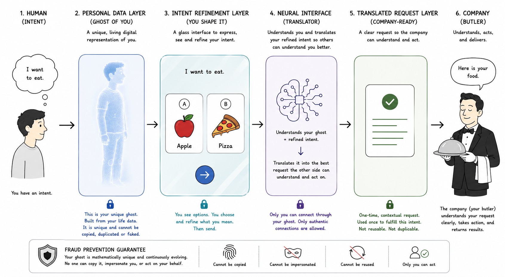

- asset_pointer: `sediment://file_00000000c4247246973555416dfd7094?shared_conversation_id=6a15c671-1c8c-8333-8c11-5f7c9be844b3`
- dimensions: 1691x930
- size_bytes: 1294616
- local_file: `assets/11__a-journey-from-intent-to-fulfillment.png`
- download_status: downloaded

---

## User — 2026-05-20T05:45:06+02:00

- message_id: `1df299e4-d455-4df6-a491-d4496fa5063b`
- index: 59
- role: user
- recipient: all
- create_time_utc: `2026-05-20T03:45:06.315Z`
- status: finished_successfully

### Content

- content_type: text

Remove the button just keep the apple and the pizza

---

## Assistant — 2026-05-20T05:45:06+02:00

- message_id: `45ac912d-6183-403a-82b8-6a13d2506692`
- index: 60
- role: assistant
- recipient: t2uay3k.sj1i4kz
- create_time_utc: `2026-05-20T03:45:06.962Z`
- status: finished_successfully
- end_turn: false

### Content

- content_type: code

```python3
{"skipped_mainline":true}
```

---

## Tool — 2026-05-20T05:45:46+02:00

- message_id: `311dd4ca-185d-4a8a-a8b0-d8d551cf9218`
- index: 61
- role: tool
- author_name: `t2uay3k.sj1i4kz`
- recipient: all
- create_time_utc: `2026-05-20T03:45:46.197Z`
- status: finished_successfully

### Content

- content_type: multimodal_text

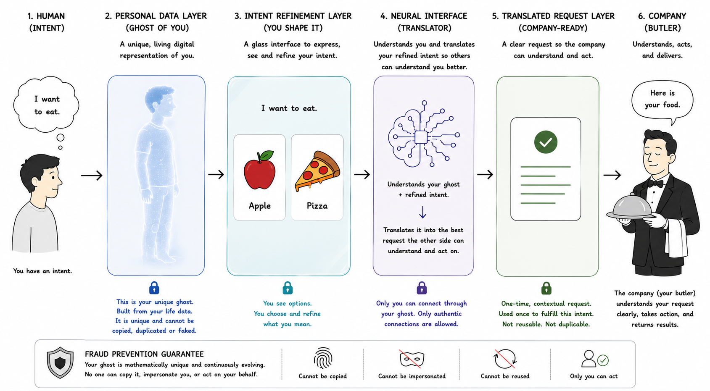

- asset_pointer: `sediment://file_00000000b770724389555ebae8ae43e7?shared_conversation_id=6a15c671-1c8c-8333-8c11-5f7c9be844b3`
- dimensions: 1689x931
- size_bytes: 1303995
- local_file: `assets/12__fraud-prevention-process-flowchart.png`
- download_status: downloaded

---

## User — 2026-05-20T05:45:55+02:00

- message_id: `d1cadf74-0ecd-4ef4-beea-de923a376456`
- index: 62
- role: user
- recipient: all
- create_time_utc: `2026-05-20T03:45:55.168Z`
- update_time_utc: `2026-05-20T03:46:50.809Z` (edited)
- status: finished_successfully

### Content

- content_type: text

Not junderstands your ghost but understands your intent and verifies your data ghost

---

## Assistant — 2026-05-20T05:45:57+02:00

- message_id: `f7fe6301-007e-49a8-a852-4eca32278f80`
- index: 63
- role: assistant
- recipient: all
- create_time_utc: `2026-05-20T03:45:57.561Z`
- status: finished_successfully

### Content

- content_type: model_editable_context

```

```

---

## System — 2026-05-20T05:45:57+02:00

- message_id: `883baa20-5448-449f-ba08-e1f9fb65c2ad`
- index: 64
- role: system
- recipient: all
- create_time_utc: `2026-05-20T03:45:57.653Z`
- status: finished_successfully
- model_slug: gpt-5-5
- message_type: next
- is_visually_hidden_from_conversation: true

### Content

- content_type: text


---

## Assistant — 2026-05-20T05:45:57+02:00

- message_id: `79b9cee2-3ab4-451a-b664-3e26bb1986c4`
- index: 65
- role: assistant
- recipient: t2uay3k.sj1i4kz
- create_time_utc: `2026-05-20T03:45:57.541Z`
- status: finished_successfully
- end_turn: false
- model_slug: gpt-5-5
- message_type: next

### Content

- content_type: code

```unknown
{"size":"1792x1024","n":1}
```

---

## Tool — 2026-05-20T05:46:48+02:00

- message_id: `dc2d5a59-414b-4db3-8f59-f74a9f13bb95`
- index: 66
- role: tool
- author_name: `t2uay3k.sj1i4kz`
- recipient: all
- create_time_utc: `2026-05-20T03:46:48.650Z`
- status: finished_successfully
- model_slug: gpt-5-5
- message_type: next

### Content

- content_type: multimodal_text

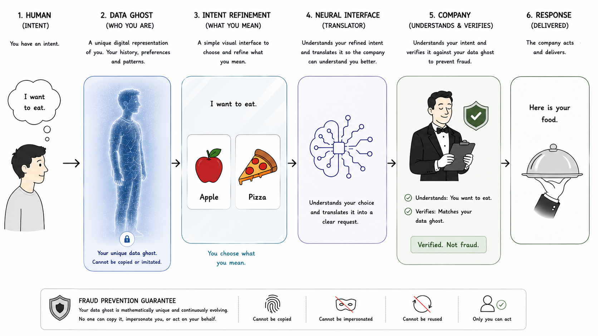

- asset_pointer: `sediment://file_000000007728720abf03ad9c16b5446b?shared_conversation_id=6a15c671-1c8c-8333-8c11-5f7c9be844b3`
- dimensions: 1672x941
- size_bytes: 1410599
- local_file: `assets/13__fraud-prevention-user-journey-diagram.png`
- download_status: downloaded

---

## Assistant — 2026-05-20T05:46:48+02:00

- message_id: `c70a6664-6f32-474a-8e8d-3ac98ef109ce`
- index: 67
- role: assistant
- recipient: all
- create_time_utc: `2026-05-20T03:46:48.647Z`
- status: finished_successfully
- end_turn: true
- model_slug: gpt-5-5
- message_type: next

### Content

- content_type: text


---

## User — 2026-05-20T05:48:34+02:00

- message_id: `54205d5f-27d1-4d79-b57e-e1ec3665866f`
- index: 68
- role: user
- recipient: all
- create_time_utc: `2026-05-20T03:48:34.934Z`
- update_time_utc: `2026-05-20T03:49:20.089Z` (edited)
- status: finished_successfully

### Content

- content_type: text

I likes the previous ghost style more and keep the butler who represents the company outside of the box

No need for another box where ther intent is served on the right

---

## Assistant — 2026-05-20T05:48:35+02:00

- message_id: `fed428bb-0b6d-44ae-a481-825106a0822c`
- index: 69
- role: assistant
- recipient: all
- create_time_utc: `2026-05-20T03:48:35.325Z`
- status: finished_successfully

### Content

- content_type: model_editable_context

```

```

---

## Assistant — 2026-05-20T05:48:35+02:00

- message_id: `dac1215e-333f-4469-8eec-aceb72df7391`
- index: 70
- role: assistant
- recipient: t2uay3k.sj1i4kz
- create_time_utc: `2026-05-20T03:48:35.323Z`
- status: finished_successfully
- end_turn: false
- model_slug: gpt-5-5
- message_type: next

### Content

- content_type: code

```unknown
{"size":"1792x1024","n":1}
```

---

## Tool — 2026-05-20T05:49:17+02:00

- message_id: `45db5d14-89d5-4a3b-8882-fb8122b53ae4`
- index: 71
- role: tool
- author_name: `t2uay3k.sj1i4kz`
- recipient: all
- create_time_utc: `2026-05-20T03:49:17.450Z`
- status: finished_successfully
- model_slug: gpt-5-5
- message_type: next

### Content

- content_type: multimodal_text

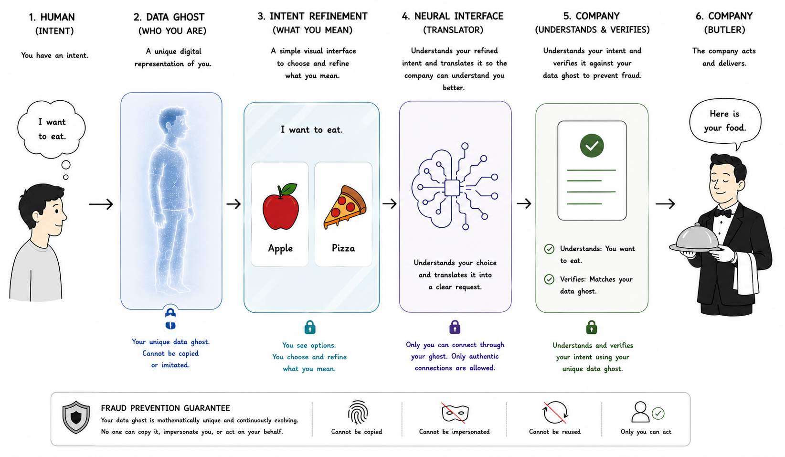

- asset_pointer: `sediment://file_00000000971c720a82f18f5657a61355?shared_conversation_id=6a15c671-1c8c-8333-8c11-5f7c9be844b3`
- dimensions: 1644x957
- size_bytes: 1257265
- local_file: `assets/14__fraud-prevention-process-flowchart.png`
- download_status: downloaded

---

## Assistant — 2026-05-20T05:49:17+02:00

- message_id: `c00275f2-9d0d-410d-94b8-a916562c1529`
- index: 72
- role: assistant
- recipient: all
- create_time_utc: `2026-05-20T03:49:17.445Z`
- status: finished_successfully
- end_turn: true
- model_slug: gpt-5-5
- message_type: next

### Content

- content_type: text


---

## User — 2026-05-20T05:52:24+02:00

- message_id: `1443f4ec-4046-4e7f-9393-ee9ad820d213`
- index: 73
- role: user
- recipient: all
- create_time_utc: `2026-05-20T03:52:24.988Z`
- update_time_utc: `2026-05-20T03:52:29.873Z` (edited)
- status: finished_successfully

### Content

- content_type: text

Ok summarize for a tweet that this is how I see the human computer interaction with the neural computer that Andrej karpathy mentioned in his sequoia capital interview on stage.

Formulate it as a question to Andrej

---

## Assistant — 2026-05-20T05:52:25+02:00

- message_id: `601f10a4-535f-4c0f-8c45-70711835f63b`
- index: 74
- role: assistant
- recipient: all
- create_time_utc: `2026-05-20T03:52:25.598Z`
- status: finished_successfully

### Content

- content_type: model_editable_context

```

```

---

## System — 2026-05-20T05:52:25+02:00

- message_id: `cd0f0e49-c475-47dd-9af3-6e338284e186`
- index: 75
- role: system
- recipient: all
- create_time_utc: `2026-05-20T03:52:25.622Z`
- status: finished_successfully
- model_slug: gpt-5-5
- message_type: next
- is_visually_hidden_from_conversation: true

### Content

- content_type: text


---

## Assistant — 2026-05-20T05:52:25+02:00

- message_id: `17bf6a10-8118-4870-881e-8e82c0ba911b`
- index: 76
- role: assistant
- recipient: all
- create_time_utc: `2026-05-20T03:52:25.594Z`
- status: finished_successfully
- end_turn: true
- model_slug: gpt-5-5
- message_type: next

### Content

- content_type: text

:::writing{variant="social_post" id="48271"}
Andrej Karpathy, after your Sequoia interview about the “neural computer,” I’ve been thinking about human-computer interaction differently:

What if the future interface is not apps or prompts, but a “neural computer” that:
- verifies a unique personal data ghost of you (history, preferences, relationships, patterns)
- lets humans refine intent visually through simple image/sound interfaces
- translates that intent into something companies/services can understand and fulfill
- while preventing impersonation or fraud because the “ghost” cannot be copied

So instead of software understanding commands, it understands authenticated intent.

Is this close to how you imagine neural computer interaction evolving?
:::

---

## User — 2026-05-20T05:53:21+02:00

- message_id: `ce45402e-3d1b-4fc2-817d-30234bdd4a36`
- index: 77
- role: user
- recipient: all
- create_time_utc: `2026-05-20T03:53:21.140Z`
- update_time_utc: `2026-05-20T03:53:24.300Z` (edited)
- status: finished_successfully

### Content

- content_type: text

No more like:

Is this a good visualization of how we will interact with the Neural Computer you mentioned on the Sequoia stage?

---

## Assistant — 2026-05-20T05:53:21+02:00

- message_id: `ff8a5d42-0163-447d-8ce8-8628b21e9a4d`
- index: 78
- role: assistant
- recipient: all
- create_time_utc: `2026-05-20T03:53:21.516Z`
- status: finished_successfully
- end_turn: true
- model_slug: gpt-5-5
- message_type: next

### Content

- content_type: text

:::writing{variant="social_post" id="18452"}
Andrej Karpathy — is this a good visualization of how we may interact with the “Neural Computer” you mentioned during the Sequoia stage interview?

A human intent → paired with a unique personal “data ghost” → refined visually through simple image/sound interfaces → translated by the neural computer into authenticated intent that companies/services can understand and fulfill.

The interesting part to me is that the system verifies the uniqueness of the human context without exposing or duplicating the person themselves.
:::

---

## User — 2026-05-20T05:53:57+02:00

- message_id: `e1d64864-60b5-4001-ac93-6f68a8d41159`
- index: 79
- role: user
- recipient: all
- create_time_utc: `2026-05-20T03:53:57.641Z`
- update_time_utc: `2026-05-20T03:54:00.817Z` (edited)
- status: finished_successfully

### Content

- content_type: text

It’s a tweet so less than 280 characters - here’s his handle @karpathy

---

## System — 2026-05-20T05:53:58+02:00

- message_id: `436f5965-1b74-4773-ab1d-3469e14107f1`
- index: 80
- role: system
- recipient: all
- create_time_utc: `2026-05-20T03:53:58.026Z`
- status: finished_successfully
- model_slug: gpt-5-5
- message_type: next
- is_visually_hidden_from_conversation: true

### Content

- content_type: text


---

## Assistant — 2026-05-20T05:53:58+02:00

- message_id: `8fe37172-7acf-41ea-b94d-902a0c44db47`
- index: 81
- role: assistant
- recipient: all
- create_time_utc: `2026-05-20T03:53:58.023Z`
- status: finished_successfully
- end_turn: true
- model_slug: gpt-5-5
- message_type: next

### Content

- content_type: text

:::writing{variant="social_post" id="53184"}
@karpathy — is this a good visualization of how humans may interact with the “Neural Computer” you mentioned on the Sequoia stage?

Human intent + a unique personal “data ghost” → visual intent refinement → neural translation → authenticated requests companies can fulfill.
:::

---

## User — 2026-05-20T05:58:50+02:00

- message_id: `27cc6b5b-1049-4d62-9ecc-c18d06d92bf4`
- index: 82
- role: user
- recipient: all
- create_time_utc: `2026-05-20T03:58:50.546Z`
- update_time_utc: `2026-05-20T03:59:51.312Z` (edited)
- status: finished_successfully

### Content

- content_type: text

Now for the image bring into the mix bitcoin as the pure data money to pay for the intent fulfillment and also the authentication layer through cryptographic security 

---

## Assistant — 2026-05-20T05:58:50+02:00

- message_id: `3564da34-3bfe-468e-ad5d-ed007aa889e6`
- index: 83
- role: assistant
- recipient: t2uay3k.sj1i4kz
- create_time_utc: `2026-05-20T03:58:50.924Z`
- status: finished_successfully
- end_turn: false
- model_slug: gpt-5-5
- message_type: next

### Content

- content_type: code

```unknown
{"size":"1792x1024","n":1}
```

---

## Tool — 2026-05-20T05:59:50+02:00

- message_id: `c17b5e2b-471a-4c83-acca-d9effa702960`
- index: 84
- role: tool
- author_name: `t2uay3k.sj1i4kz`
- recipient: all
- create_time_utc: `2026-05-20T03:59:50.787Z`
- status: finished_successfully
- model_slug: gpt-5-5
- message_type: next

### Content

- content_type: multimodal_text


- asset_pointer: `sediment://file_00000000e6f471f4a9181aec6c8b2a1a?shared_conversation_id=6a15c671-1c8c-8333-8c11-5f7c9be844b3`
- dimensions: 1672x941
- size_bytes: 1487919
- local_file: `assets/15__image-15.png`
- download_status: unavailable

---

## Assistant — 2026-05-20T05:59:50+02:00

- message_id: `839c6dc7-4f67-429b-8578-97e9a2f14a44`
- index: 85
- role: assistant
- recipient: all
- create_time_utc: `2026-05-20T03:59:50.820Z`
- status: finished_successfully
- end_turn: true
- model_slug: gpt-5-5
- message_type: next
- is_visually_hidden_from_conversation: true

### Content

- content_type: text

The above image generation task was cancelled by the user and therefore the generated image is incomplete. The image will not finish generating and is not completed or successful. You need to re-generate the image for it to complete. Please note that the above image is incomplete and was cancelled if asked about the image generation by the user.

---

## User — 2026-05-20T06:01:12+02:00

- message_id: `bfce8953-02f5-4946-b13d-c9d5954994f8`
- index: 86
- role: user
- recipient: all
- create_time_utc: `2026-05-20T04:01:12.700Z`
- update_time_utc: `2026-05-20T04:01:17.166Z` (edited)
- status: finished_successfully

### Content

- content_type: text

Make a linked in post that I visualized this based on the word drop of Andrej karpathy “Neural computer” in the sequoia interview https://youtu.be/96jN2OCOfLs?is=bBGRa5_P-SrXe-_Z

Explain what the graphic is about in a simple way

---

## Assistant — 2026-05-20T06:01:13+02:00

- message_id: `afca1c88-6b23-487b-a5e1-e1a495eb2c56`
- index: 87
- role: assistant
- recipient: all
- create_time_utc: `2026-05-20T04:01:13.054Z`
- status: finished_successfully
- end_turn: true
- model_slug: gpt-5-5
- message_type: next

### Content

- content_type: text

:::writing{variant="social_post" id="62418"}
Recently I watched @karpathy’s Sequoia interview where he mentioned the idea of a “Neural Computer.”  
It got me thinking about what human-computer interaction could look like in that world, so I tried to visualize it.

The idea behind this graphic:

- Your personal data/history forms a unique “data ghost” of you  
- A visual interface (images, sound, choices) helps you refine intent naturally  
- The neural computer translates that intent into something companies/services can understand and fulfill  
- Cryptographic verification + Bitcoin-style authentication/payments secure the interaction without exposing or duplicating the human

In this model, the core primitive is no longer apps or forms — but authenticated human intent.

Sequoia interview:
https://youtu.be/96jN2OCOfLs?is=bBGRa5_P-SrXe-_Z
:::

---

## User — 2026-05-20T06:01:51+02:00

- message_id: `21e93747-7a02-468b-b698-5cc20f3d087a`
- index: 88
- role: user
- recipient: all
- create_time_utc: `2026-05-20T04:01:51.603Z`
- update_time_utc: `2026-05-20T04:01:56.321Z` (edited)
- status: finished_successfully

### Content

- content_type: text

Remove the bitcoin part

---

## Assistant — 2026-05-20T06:01:52+02:00

- message_id: `7b67fe43-4272-444d-a45c-bb3771d14714`
- index: 89
- role: assistant
- recipient: all
- create_time_utc: `2026-05-20T04:01:52.082Z`
- update_time_utc: `2026-05-20T04:03:31.458Z` (edited)
- status: finished_successfully
- end_turn: true
- model_slug: gpt-5-5
- message_type: next

### Content

- content_type: text

:::writing{variant="social_post" id="41725"}
Recently I watched @karpathy’s Sequoia interview where he mentioned the idea of a “Neural Computer.”  
It got me thinking about what human-computer interaction could look like in that world, so I tried to visualize it.

The idea behind this graphic:

- Your personal data/history forms a unique “data ghost” of you  
- A visual interface (images, sound, choices) helps you refine intent naturally  
- The neural computer translates that intent into something companies/services can understand and fulfill  
- Cryptographic verification secures the interaction without exposing or duplicating the human

In this model, the core primitive is no longer apps or forms — but authenticated human intent.

Sequoia interview:
https://youtu.be/96jN2OCOfLs?is=bBGRa5_P-SrXe-_Z
:::

---

## User — 2026-05-20T06:02:12+02:00

- message_id: `acd16f56-0229-4b62-b313-bc346b41da2d`
- index: 90
- role: user
- recipient: all
- create_time_utc: `2026-05-20T04:02:12.366Z`
- update_time_utc: `2026-05-20T04:03:05.210Z` (edited)
- status: finished_successfully

### Content

- content_type: text

Also from the graphic 

---

## Assistant — 2026-05-20T06:02:12+02:00

- message_id: `8b735e3a-12fd-4bd6-b5f6-32437f4dbb64`
- index: 91
- role: assistant
- recipient: t2uay3k.sj1i4kz
- create_time_utc: `2026-05-20T04:02:12.735Z`
- status: finished_successfully
- end_turn: false
- model_slug: gpt-5-5
- message_type: next

### Content

- content_type: code

```unknown
{"size":"1792x1024","n":1}
```

---

## Tool — 2026-05-20T06:02:56+02:00

- message_id: `d1706c81-1bb7-4ca1-acd7-fe9f726b7eff`
- index: 92
- role: tool
- author_name: `t2uay3k.sj1i4kz`
- recipient: all
- create_time_utc: `2026-05-20T04:02:56.269Z`
- status: finished_successfully
- model_slug: gpt-5-5
- message_type: next

### Content

- content_type: multimodal_text

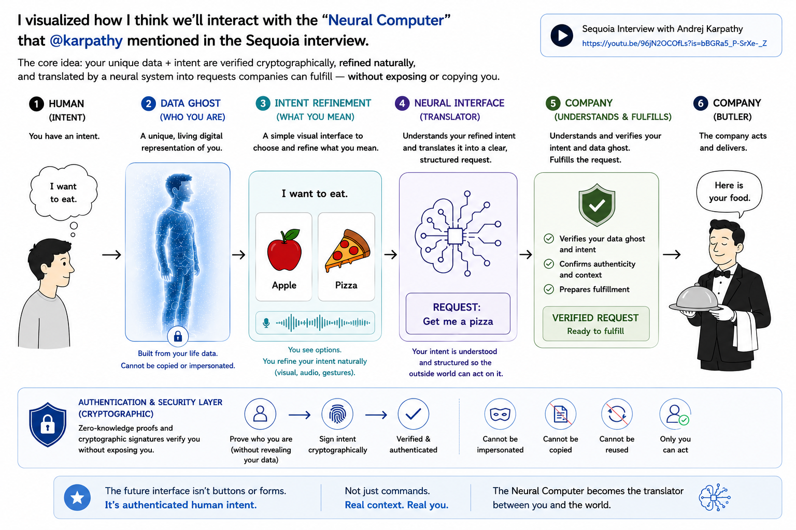

- asset_pointer: `sediment://file_000000000dd87243951c066aef44e40a?shared_conversation_id=6a15c671-1c8c-8333-8c11-5f7c9be844b3`
- dimensions: 1536x1024
- size_bytes: 1651149
- local_file: `assets/16__visualizing-interaction-with-the-neural-computer.png`
- download_status: downloaded

---

## Assistant — 2026-05-20T06:02:56+02:00

- message_id: `abb4c7c6-b9bb-4a32-8fe6-b55c9c7b0260`
- index: 93
- role: assistant
- recipient: all
- create_time_utc: `2026-05-20T04:02:56.262Z`
- status: finished_successfully
- end_turn: true
- model_slug: gpt-5-5
- message_type: next

### Content

- content_type: text


---

## User — 2026-05-20T06:07:11+02:00

- message_id: `908df4c9-3081-46f9-8d72-ae0bc52fd11d`
- index: 94
- role: user
- recipient: all
- create_time_utc: `2026-05-20T04:07:11.795Z`
- status: finished_successfully

### Content

- content_type: multimodal_text


- asset_pointer: `sediment://file_000000004df8720aba256263fe93e626?shared_conversation_id=6a15c671-1c8c-8333-8c11-5f7c9be844b3`
- dimensions: 1536x859
- size_bytes: 408439
- local_file: `assets/17__09e41bc6-82fe-41a5-bb92-95941097e379-jpeg.png`
- download_status: unavailable

I have this version now without the text on top

Now I want you to remove the sound representation on the interface just keep the apple and pizza pictures 

---

## Assistant — 2026-05-20T06:07:13+02:00

- message_id: `1020c408-2552-42e8-9c5d-332b24644787`
- index: 95
- role: assistant
- recipient: t2uay3k.sj1i4kz
- create_time_utc: `2026-05-20T04:07:13.276Z`
- status: finished_successfully
- end_turn: false

### Content

- content_type: code

```python3
{"skipped_mainline":true}
```

---

## Tool — 2026-05-20T06:07:48+02:00

- message_id: `15c3729b-ccbd-49be-8ece-b4afd8b700f5`
- index: 96
- role: tool
- author_name: `t2uay3k.sj1i4kz`
- recipient: all
- create_time_utc: `2026-05-20T04:07:48.245Z`
- status: finished_successfully

### Content

- content_type: multimodal_text

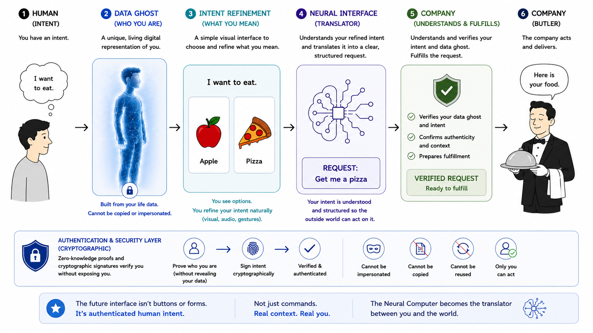

- asset_pointer: `sediment://file_00000000dcf8720aa676941ab6b0d70a?shared_conversation_id=6a15c671-1c8c-8333-8c11-5f7c9be844b3`
- dimensions: 1672x940
- size_bytes: 1442518
- local_file: `assets/18__human-intent-and-digital-fulfillment-process.png`
- download_status: downloaded

---

## User — 2026-05-20T06:08:28+02:00

- message_id: `4a6bf672-c37a-421e-88ec-7118fa22128e`
- index: 97
- role: user
- recipient: all
- create_time_utc: `2026-05-20T04:08:28.676Z`
- status: finished_successfully

### Content

- content_type: text

Also remove the ‘request get me a pizza” from the neural computer box

---

## Assistant — 2026-05-20T06:08:29+02:00

- message_id: `60fa6341-c403-4a6a-bed3-507df57b5d4a`
- index: 98
- role: assistant
- recipient: t2uay3k.sj1i4kz
- create_time_utc: `2026-05-20T04:08:29.259Z`
- status: finished_successfully
- end_turn: false

### Content

- content_type: code

```python3
{"skipped_mainline":true}
```

---

## Tool — 2026-05-20T06:09:20+02:00

- message_id: `7c1db6f8-5457-4a64-ba95-99e82278eba2`
- index: 99
- role: tool
- author_name: `t2uay3k.sj1i4kz`
- recipient: all
- create_time_utc: `2026-05-20T04:09:20.244Z`
- status: finished_successfully

### Content

- content_type: multimodal_text

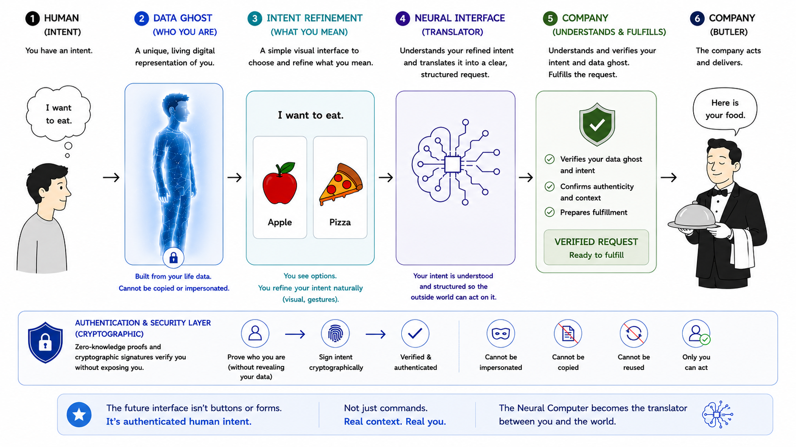

- asset_pointer: `sediment://file_00000000ba74720a985f454b3a8eeff0?shared_conversation_id=6a15c671-1c8c-8333-8c11-5f7c9be844b3`
- dimensions: 1672x940
- size_bytes: 1414015
- local_file: `assets/19__six-stages-of-authenticating-intent.png`
- download_status: downloaded

---

## User — 2026-05-20T06:11:03+02:00

- message_id: `676cf51f-9212-4642-8840-662cc268991d`
- index: 100
- role: user
- recipient: all
- create_time_utc: `2026-05-20T04:11:03.000Z`
- status: finished_successfully

### Content

- content_type: text

Actually introduce the box again for neural computer but write just “PIZZAAAA!” In the box

---

## Assistant — 2026-05-20T06:11:04+02:00

- message_id: `6d4bdc89-611e-4d0a-b4c7-bf39526aa572`
- index: 101
- role: assistant
- recipient: t2uay3k.sj1i4kz
- create_time_utc: `2026-05-20T04:11:04.335Z`
- status: finished_successfully
- end_turn: false

### Content

- content_type: code

```python3
{"skipped_mainline":true}
```

---

## Tool — 2026-05-20T06:11:57+02:00

- message_id: `6ba040bf-78fe-4306-9c04-4eabddafa001`
- index: 102
- role: tool
- author_name: `t2uay3k.sj1i4kz`
- recipient: all
- create_time_utc: `2026-05-20T04:11:57.687Z`
- status: finished_successfully

### Content

- content_type: multimodal_text

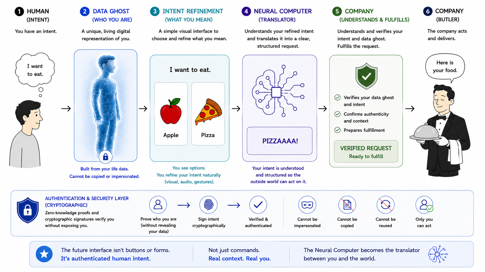

- asset_pointer: `sediment://file_00000000155c71f497989248dee06968?shared_conversation_id=6a15c671-1c8c-8333-8c11-5f7c9be844b3`
- dimensions: 1672x940
- size_bytes: 1465558
- local_file: `assets/20__human-intent-to-fulfillment-pipeline.png`
- download_status: downloaded

---

## User — 2026-05-20T06:14:12+02:00

- message_id: `a5efcd64-82ff-4f40-8d59-5a1899ed2355`
- index: 103
- role: user
- recipient: all
- create_time_utc: `2026-05-20T04:14:12.377Z`
- status: finished_successfully

### Content

- content_type: text

Remove the “I want Pizza” text from the glass pane but say something like : “what?”

---

## Assistant — 2026-05-20T06:14:13+02:00

- message_id: `a5d1ceec-a6a2-4fee-b7d1-01725387e94c`
- index: 104
- role: assistant
- recipient: t2uay3k.sj1i4kz
- create_time_utc: `2026-05-20T04:14:13.345Z`
- status: finished_successfully
- end_turn: false

### Content

- content_type: code

```python3
{"skipped_mainline":true}
```

---

## Tool — 2026-05-20T06:15:11+02:00

- message_id: `621e4112-a14d-4151-b7bb-dabbb1094d8c`
- index: 105
- role: tool
- author_name: `t2uay3k.sj1i4kz`
- recipient: all
- create_time_utc: `2026-05-20T04:15:11.422Z`
- status: finished_successfully

### Content

- content_type: multimodal_text

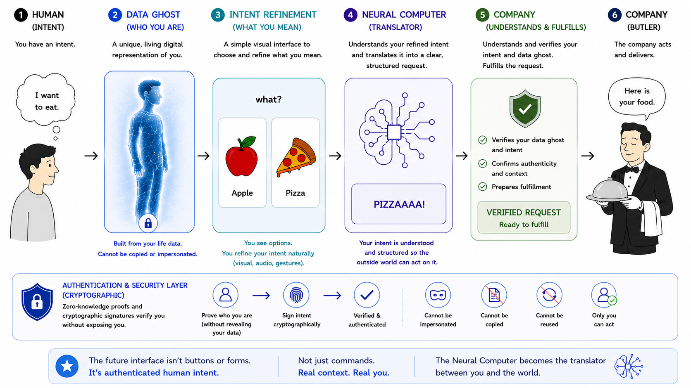

- asset_pointer: `sediment://file_00000000da20720a8186d5deb4388cc8?shared_conversation_id=6a15c671-1c8c-8333-8c11-5f7c9be844b3`
- dimensions: 1672x940
- size_bytes: 1468827
- local_file: `assets/21__visualizing-the-intent-processing-pipeline.png`
- download_status: downloaded

---

## User — 2026-05-20T06:16:52+02:00

- message_id: `932bab66-7ab7-4b42-858e-ec91e7de3a40`
- index: 106
- role: user
- recipient: all
- create_time_utc: `2026-05-20T04:16:52.718Z`
- status: finished_successfully

### Content

- content_type: text

Actually Write “ What do you want to eat?”

---

## Assistant — 2026-05-20T06:16:53+02:00

- message_id: `873a578f-a3bf-4ea1-bab3-62c4545577e1`
- index: 107
- role: assistant
- recipient: t2uay3k.sj1i4kz
- create_time_utc: `2026-05-20T04:16:53.510Z`
- status: finished_successfully
- end_turn: false

### Content

- content_type: code

```python3
{"skipped_mainline":true}
```

---

## Tool — 2026-05-20T06:17:38+02:00

- message_id: `cb1b1e62-dd99-4d5b-b189-ee792a8b1c28`
- index: 108
- role: tool
- author_name: `t2uay3k.sj1i4kz`
- recipient: all
- create_time_utc: `2026-05-20T04:17:38.609Z`
- status: finished_successfully

### Content

- content_type: multimodal_text

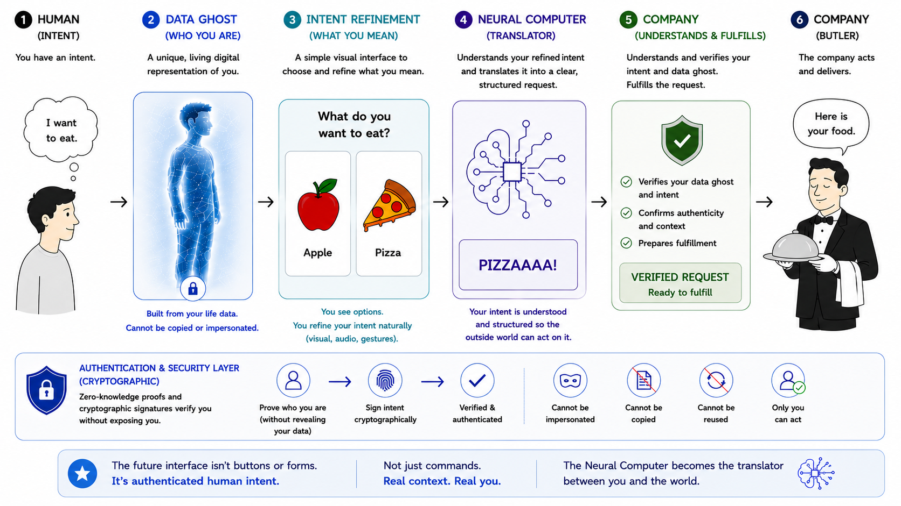

- asset_pointer: `sediment://file_000000004ba0720aa4c08b3192dce5aa?shared_conversation_id=6a15c671-1c8c-8333-8c11-5f7c9be844b3`
- dimensions: 1672x941
- size_bytes: 1478300
- local_file: `assets/22__human-intent-and-digital-translation-process.png`
- download_status: downloaded

---

## User — 2026-05-20T06:20:54+02:00

- message_id: `b8034ee2-0b48-4e2b-873d-5b6f68178e2e`
- index: 109
- role: user
- recipient: all
- create_time_utc: `2026-05-20T04:20:54.908Z`
- status: finished_successfully

### Content

- content_type: text

Can you emotionalize the “Pizzaaaaa” visually

---

## Assistant — 2026-05-20T06:20:56+02:00

- message_id: `9bd497e9-de2c-46e7-b5b9-000ffc7b7c8d`
- index: 110
- role: assistant
- recipient: t2uay3k.sj1i4kz
- create_time_utc: `2026-05-20T04:20:56.046Z`
- status: finished_successfully
- end_turn: false

### Content

- content_type: code

```python3
{"skipped_mainline":true}
```

---

## Tool — 2026-05-20T06:21:53+02:00

- message_id: `fb980c96-ba7d-41f4-a674-3cf9420d715b`
- index: 111
- role: tool
- author_name: `t2uay3k.sj1i4kz`
- recipient: all
- create_time_utc: `2026-05-20T04:21:53.416Z`
- status: finished_successfully

### Content

- content_type: multimodal_text

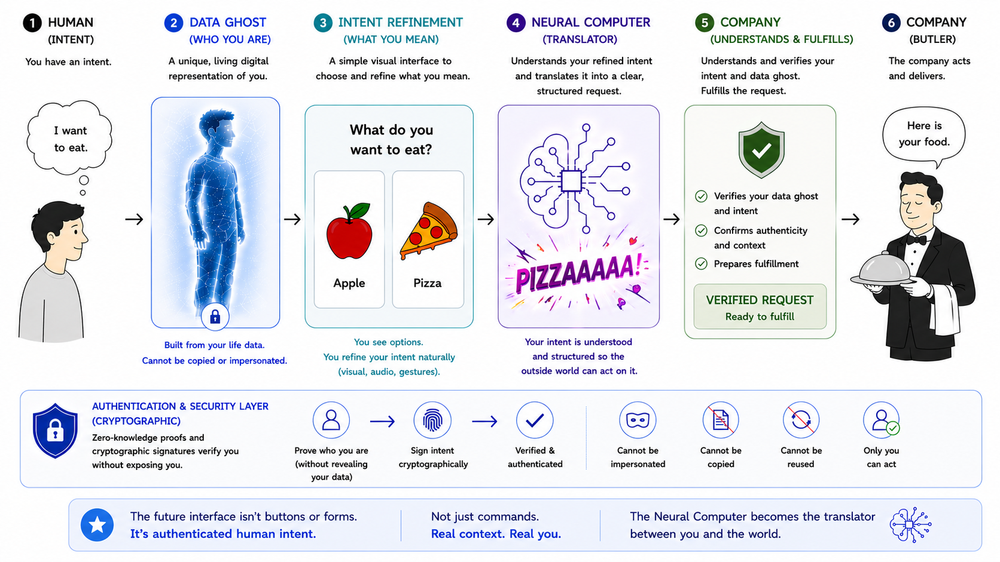

- asset_pointer: `sediment://file_00000000d134720a8be4e897ce86faf0?shared_conversation_id=6a15c671-1c8c-8333-8c11-5f7c9be844b3`
- dimensions: 1672x941
- size_bytes: 1500244
- local_file: `assets/23__ai-intent-system-flowchart-infographic.png`
- download_status: downloaded

---

## Tool — 2026-05-20T06:21:53+02:00

- message_id: `40bbc5b7-03b8-4072-9b90-8c4e34e25ea9`
- index: 112
- role: tool
- author_name: `t2uay3k.sj1i4kz`
- recipient: all
- create_time_utc: `2026-05-20T04:21:53.421Z`
- status: finished_successfully

### Content

- content_type: multimodal_text

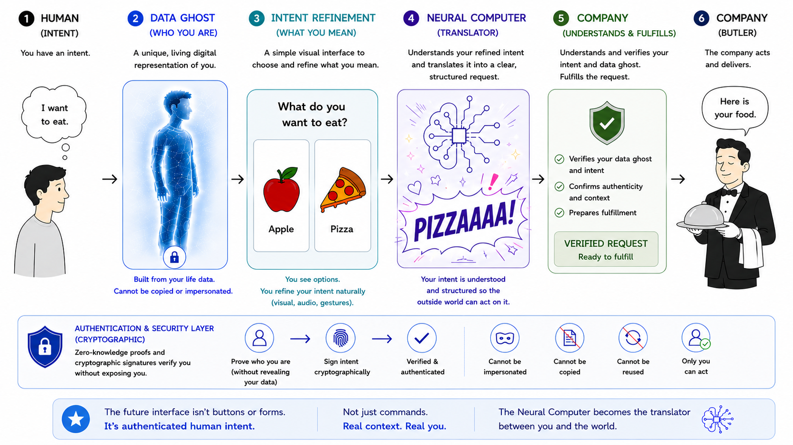

- asset_pointer: `sediment://file_0000000068ec720a8f6e5b16b363a616?shared_conversation_id=6a15c671-1c8c-8333-8c11-5f7c9be844b3`
- dimensions: 1672x941
- size_bytes: 1522491
- local_file: `assets/24__human-intent-and-process-flow.png`
- download_status: downloaded

---

## User — 2026-05-20T06:24:30+02:00

- message_id: `d3d8be30-efec-4fa1-981e-8d5117cb372f`
- index: 113
- role: user
- recipient: all
- create_time_utc: `2026-05-20T04:24:30.593Z`
- update_time_utc: `2026-05-20T04:24:37.389Z` (edited)
- status: finished_successfully

### Content

- content_type: text

Ok can you now write the tweet at Andrej again

---

## System — 2026-05-20T06:24:30+02:00

- message_id: `b975c446-6443-4f84-9c62-a0ff45540bf3`
- index: 114
- role: system
- recipient: all
- create_time_utc: `2026-05-20T04:24:30.955Z`
- status: finished_successfully
- is_visually_hidden_from_conversation: true

### Content

- content_type: text


---

## Assistant — 2026-05-20T06:24:31+02:00

- message_id: `4516b3d5-99d7-493e-b9dc-2dbc3f7b6c42`
- index: 115
- role: assistant
- recipient: all
- create_time_utc: `2026-05-20T04:24:31.010Z`
- status: finished_successfully

### Content

- content_type: model_editable_context

```

```

---

## System — 2026-05-20T06:24:31+02:00

- message_id: `d1689eb3-12c2-49ee-aaa7-848abe22a5c8`
- index: 116
- role: system
- recipient: all
- create_time_utc: `2026-05-20T04:24:31.033Z`
- status: finished_successfully
- model_slug: gpt-5-5
- message_type: next
- is_visually_hidden_from_conversation: true

### Content

- content_type: text


---

## System — 2026-05-20T06:24:31+02:00

- message_id: `2ea8e2c3-6a05-4f5e-befe-d14a7c2c500d`
- index: 117
- role: system
- recipient: all
- create_time_utc: `2026-05-20T04:24:31.033Z`
- status: finished_successfully
- model_slug: gpt-5-5
- message_type: next
- is_visually_hidden_from_conversation: true

### Content

- content_type: text


---

## Assistant — 2026-05-20T06:24:31+02:00

- message_id: `5263af7e-8584-480a-bc0b-1e74c1361805`
- index: 118
- role: assistant
- recipient: all
- create_time_utc: `2026-05-20T04:24:31.033Z`
- status: finished_successfully
- end_turn: true
- model_slug: gpt-5-5
- message_type: next

### Content

- content_type: text

:::writing{variant="social_post" id="27481"}
@karpathy — is this a good visualization of how humans may interact with the “Neural Computer” you mentioned on the Sequoia stage?

A unique personal “data ghost” + visual intent refinement + neural translation into authenticated requests companies can understand and fulfill.
:::

---

## User — 2026-05-20T06:26:04+02:00

- message_id: `2dac1a38-68cc-40cc-ac83-b225176a90c3`
- index: 119
- role: user
- recipient: all
- create_time_utc: `2026-05-20T04:26:04.066Z`
- update_time_utc: `2026-05-20T04:26:10.540Z` (edited)
- status: finished_successfully

### Content

- content_type: text

Ok now write it as a linked in post of how I understood the word drop of Andrej karpathy 

---

## Assistant — 2026-05-20T06:26:04+02:00

- message_id: `5f25261d-6d1d-49be-a5f6-f57d104fd768`
- index: 120
- role: assistant
- recipient: all
- create_time_utc: `2026-05-20T04:26:04.573Z`
- status: finished_successfully

### Content

- content_type: model_editable_context

```

```

---

## System — 2026-05-20T06:26:04+02:00

- message_id: `5bc4ec52-d011-4e15-a710-74639221e93b`
- index: 121
- role: system
- recipient: all
- create_time_utc: `2026-05-20T04:26:04.583Z`
- status: finished_successfully
- model_slug: gpt-5-5
- message_type: next
- is_visually_hidden_from_conversation: true

### Content

- content_type: text


---

## Assistant — 2026-05-20T06:26:04+02:00

- message_id: `9c88755d-f069-41c1-a77e-b4086aa2be2d`
- index: 122
- role: assistant
- recipient: all
- create_time_utc: `2026-05-20T04:26:04.562Z`
- status: finished_successfully
- end_turn: true
- model_slug: gpt-5-5
- message_type: next

### Content

- content_type: text

:::writing{variant="social_post" id="58314"}
One phrase from @karpathy during the Sequoia interview stayed in my head:

“Neural Computer.”

I started thinking about what human-computer interaction could actually look like in that world, and tried to visualize it.

My interpretation:

Instead of humans navigating apps, forms, filters, and interfaces manually, the core interaction becomes authenticated intent.

A human has an intent.  
A unique “data ghost” — built from history, preferences, context, and behavior — helps verify authenticity without exposing the person itself.

Then a visual interface (images, sound, gestures, choices) helps refine that intent naturally.

The “Neural Computer” becomes the translator between humans and the outside world:
- understanding intent
- structuring it
- authenticating it
- and translating it into something companies and services can fulfill.

In this model, software becomes less about menus and more about understanding real human context.

Not commands.  
Not forms.  
Authenticated intent.
:::

---

## User — 2026-05-20T06:26:56+02:00

- message_id: `e165f3cb-26ad-40b5-89df-1562c307eea4`
- index: 123
- role: user
- recipient: all
- create_time_utc: `2026-05-20T04:26:56.395Z`
- update_time_utc: `2026-05-20T04:27:02.333Z` (edited)
- status: finished_successfully

### Content

- content_type: text

A generative interface because it’s generated on the fly 

---

## Assistant — 2026-05-20T06:26:57+02:00

- message_id: `6b03b35e-9679-40a1-a034-8edf67141c7e`
- index: 124
- role: assistant
- recipient: all
- create_time_utc: `2026-05-20T04:26:57.582Z`
- status: finished_successfully
- end_turn: true
- model_slug: gpt-5-5
- message_type: next

### Content

- content_type: text

:::writing{variant="social_post" id="63827"}
One phrase from @karpathy during the Sequoia interview stayed in my head:

“Neural Computer.”

I started thinking about what human-computer interaction could actually look like in that world, and tried to visualize it.

My interpretation:

Instead of humans navigating apps, forms, filters, and interfaces manually, the core interaction becomes authenticated intent.

A human has an intent.  
A unique “data ghost” — built from history, preferences, context, and behavior — helps verify authenticity without exposing the person itself.

Then a generative interface — created on the fly through visuals, sound, gestures, and choices — helps refine that intent naturally in real time.

The “Neural Computer” becomes the translator between humans and the outside world:
- understanding intent
- structuring it
- authenticating it
- and translating it into something companies and services can fulfill.

Not commands.  
Not static apps.  
But dynamically generated interfaces around authenticated human intent.
:::

---

## User — 2026-05-20T06:28:28+02:00

- message_id: `52e04fd7-92b0-434f-8fed-3e8a4d0c39a9`
- index: 125
- role: user
- recipient: all
- create_time_utc: `2026-05-20T04:28:28.779Z`
- update_time_utc: `2026-05-20T04:28:35.003Z` (edited)
- status: finished_successfully

### Content

- content_type: text

No I mean like this

One phrase from @karpathy during the Sequoia interview stayed in my head:

“The Neural Computer.”

I started thinking about what human-computer interaction could actually look like in that world, and tried to visualize it.

My interpretation:

Instead of humans navigating apps, forms, filters, and interfaces manually, the core interaction becomes authenticated intent.

A human has an intent.  
A unique “data ghost” — built from history, preferences, context, and behavior — helps verify authenticity without exposing the person itself.

Then a visual interface (images, sound, gestures, choices) helps refine that intent naturally.

The “Neural Computer” becomes the translator between humans and the outside world:
- understanding intent
- structuring it
- authenticating it
- and translating it into something companies and services can fulfill.

In this model, software becomes less about menus and more about understanding real human context.

Not commands.  
Not forms.  
Authenticated intent.

---

## Assistant — 2026-05-20T06:28:29+02:00

- message_id: `e1d2d9b4-924c-4c58-82c6-94f977459aa4`
- index: 126
- role: assistant
- recipient: all
- create_time_utc: `2026-05-20T04:28:29.656Z`
- status: finished_successfully

### Content

- content_type: model_editable_context

```

```

---

## System — 2026-05-20T06:28:29+02:00

- message_id: `8c581cd6-2408-49a9-b2ee-430b8597e158`
- index: 127
- role: system
- recipient: all
- create_time_utc: `2026-05-20T04:28:29.684Z`
- status: finished_successfully
- model_slug: gpt-5-5
- message_type: next
- is_visually_hidden_from_conversation: true

### Content

- content_type: text


---

## Assistant — 2026-05-20T06:28:29+02:00

- message_id: `b62e6793-e3a3-4f98-93cc-3d71497e4676`
- index: 128
- role: assistant
- recipient: all
- create_time_utc: `2026-05-20T04:28:29.649Z`
- status: finished_successfully
- end_turn: true
- model_slug: gpt-5-5
- message_type: next

### Content

- content_type: text

:::writing{variant="social_post" id="41286"}
One phrase from @karpathy during the Sequoia interview stayed in my head:

“The Neural Computer.”

I started thinking about what human-computer interaction could actually look like in that world, and tried to visualize it.

My interpretation:

Instead of humans navigating apps, forms, filters, and interfaces manually, the core interaction becomes authenticated intent.

A human has an intent.  
A unique “data ghost” — built from history, preferences, context, and behavior — helps verify authenticity without exposing the person itself.

Then a generative interface (images, sound, gestures, choices generated on the fly) helps refine that intent naturally.

The “Neural Computer” becomes the translator between humans and the outside world:
- understanding intent
- structuring it
- authenticating it
- and translating it into something companies and services can fulfill.

In this model, software becomes less about menus and more about understanding real human context.

Not commands.  
Not forms.  
Authenticated intent.
:::

---

## User — 2026-05-20T06:29:21+02:00

- message_id: `10763aaf-3899-4b80-af47-826539174e0c`
- index: 129
- role: user
- recipient: all
- create_time_utc: `2026-05-20T04:29:21.713Z`
- update_time_utc: `2026-05-20T04:29:26.046Z` (edited)
- status: finished_successfully

### Content

- content_type: text

Isn’t it better to lead with a question? Or with that word 

Like neural computer that started the spark or something like that

---

## Assistant — 2026-05-20T06:29:23+02:00

- message_id: `cd5fb9b5-daf0-408e-a6a1-f966aeb87442`
- index: 130
- role: assistant
- recipient: all
- create_time_utc: `2026-05-20T04:29:23.368Z`
- status: finished_successfully
- end_turn: true
- model_slug: gpt-5-5
- message_type: next

### Content

- content_type: text

:::writing{variant="social_post" id="52741"}
“Neural Computer.”

That single phrase from @karpathy during the Sequoia interview sparked a thought for me:

What if the future of human-computer interaction is no longer apps or forms — but authenticated intent?

I tried to visualize what that could look like.

A human has an intent.  
A unique “data ghost” — built from history, preferences, context, and behavior — helps verify authenticity without exposing the person itself.

Then a generative interface (images, sound, gestures, choices generated on the fly) helps refine that intent naturally.

The “Neural Computer” becomes the translator between humans and the outside world:
- understanding intent
- structuring it
- authenticating it
- and translating it into something companies and services can fulfill.

In this model, software becomes less about menus and more about understanding real human context.

Not commands.  
Not forms.  
Authenticated intent.
:::

---
